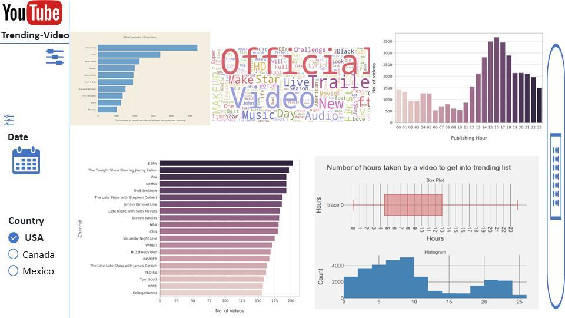

# YouTube-Trending-Video

## About the Project
This project developed a dashboard for content creators, digital marketers and media strategy teams in North America. Focusing on the U.S., Canada, and Mexico, the tool provides an in-depth analysis of trending videos on YouTube to gain insight into viewer preferences and effective content strategies.

## Motivation
In the dynamic landscape of YouTube, it's crucial to understand content trends and audience engagement. Our dashboard addresses this by analyzing trending videos, helping users navigate the complex content landscape and tailor their strategies to maximize engagement.

## Data Description
We utilize the YouTube Trending Video Dataset, focusing on data from the USA, Canada, and Mexico over the most recent three months. The dataset includes variables like video ID, title, channel title, publication and trending dates, categories, viewer engagement metrics, and more.

## Research Questions
1. What content trends in each country?
2. Patterns in the timing of trending videos.
3. Time interval for a video to become trending.
4. Channels with the most trending videos.
5. Common words in titles of trending videos.

## Description of your app & sketch
The YouTube Trending Video Analytics Dashboard's main page visualizes the spread of trending videos, segmented by dates and geographical regions. With a selection menu, users can hone in on trends within the US, Canada, or Mexico. A date range picker further customizes the trend display. The homepage's word cloud dynamically illustrates prevalent terms from video titles, offering quick visual cues to discern viewer preferences and inform content strategy. The dashboard's scrolling interface provides insight into YouTube's popularity mechanics by allowing comparative analysis of genre attention, video popularity time, channel success, and the duration from video posting to popular status.

#### Sketch of the application

## Team Members
- Shiyi Chen
- Ruomeng Tian
- Zerui Zhang
- Hanwen Zhang

## Acknowledgments
[Optional section to acknowledge any assistance or resources that contributed to the project.]

## License
This project is licensed under the MIT License - see the LICENSE.md file for details.

## Contact
For any queries or suggestions, please reach out to us via GitHub or our project email.